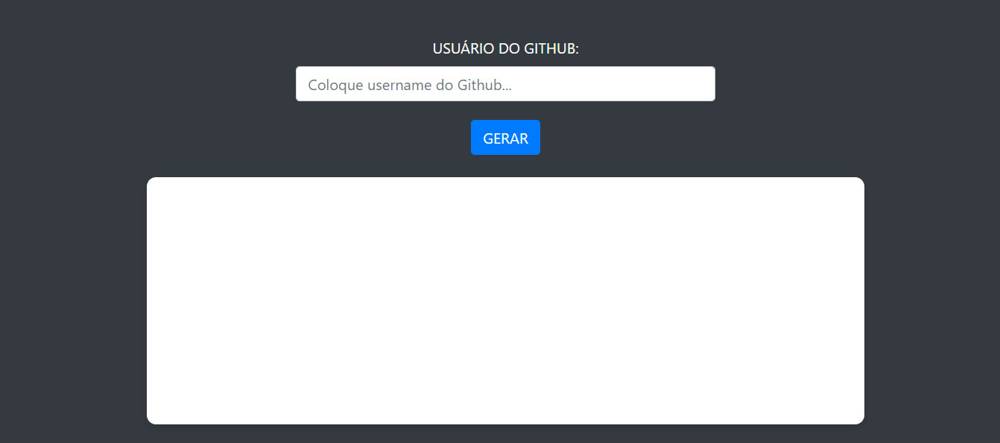
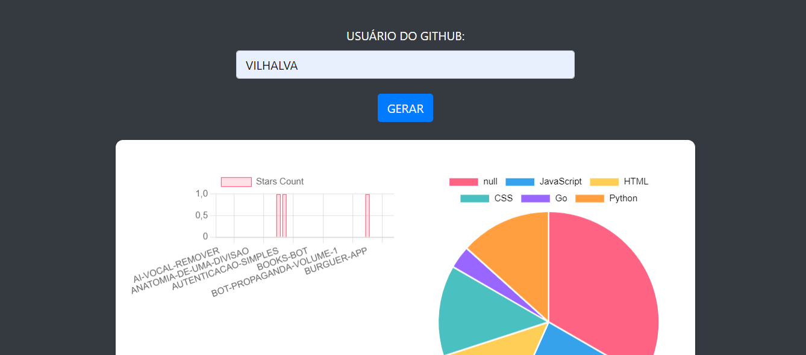
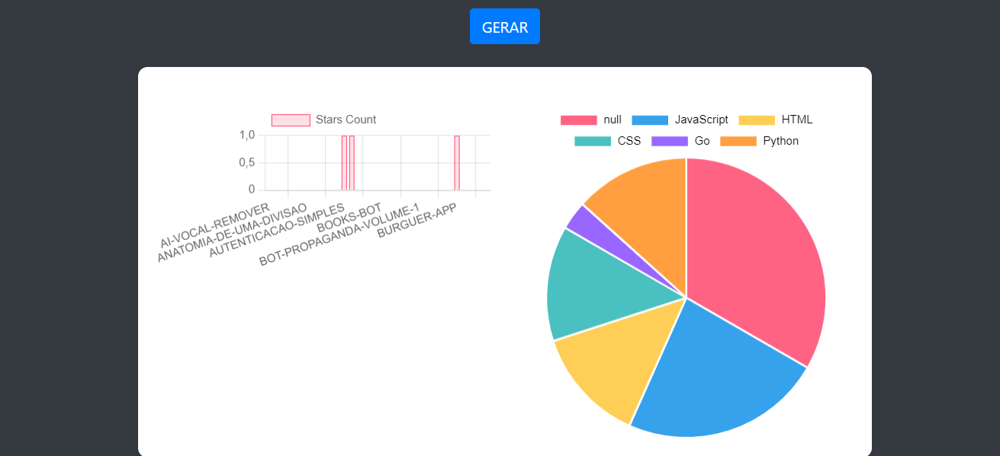

# ESTATISTICAS DO GITHUB
👨‍🏫VEJA AS ESTATISTICAS DOS REPOSITÓRIOS DOS USUÁRIOS VIA CHARTJS E API DO GITHUB.

    
    
  

## DESCRIÇÃO:
Este projeto é uma aplicação web que consome a API do GitHub para obter informações sobre os repositórios públicos de um usuário específico e exibe esses dados em gráficos interativos. Utilizamos a biblioteca Chart.js para gerar gráficos de barras e gráficos de pizza, proporcionando uma visualização clara e intuitiva dos dados obtidos.

## FUNCIONALIDADES:
- **Formulário de Entrada**: Permite ao usuário inserir o nome de usuário do GitHub para buscar seus repositórios.
- **Gráficos Interativos**:
  - **Gráfico de Barras**: Exibe a contagem de estrelas (`stargazers_count`) de cada repositório do usuário.
  - **Gráfico de Pizza**: Mostra a distribuição das linguagens de programação utilizadas nos repositórios do usuário.
- **Validação de Entrada**: Verifica se o campo de nome de usuário não está vazio antes de fazer a solicitação à API.
- **Tratamento de Erros**: Exibe alertas em caso de erros na solicitação à API (e.g., usuário não encontrado, problemas no servidor).
- **Estilo Responsivo**: A aplicação é estilizada com Bootstrap e CSS personalizado para uma aparência moderna e responsiva.

## COMO USAR?
1. **Abrindo App:** Abra o `./CODIGO/CODIGO.html` no navegador de sua preferência.
2. **Insira o Nome de Usuário do GitHub**:
   - No campo "USUÁRIO DO GITHUB", digite o nome de usuário de um perfil público do GitHub.
   - Clique no botão "GERAR" para enviar a solicitação.
3. **Visualize os Gráficos**:
   - Se o nome de usuário for válido e a solicitação for bem-sucedida, dois gráficos serão exibidos:
     - Um gráfico de barras mostrando a contagem de estrelas de cada repositório.
     - Um gráfico de pizza mostrando a distribuição das linguagens de programação nos repositórios.
4. **Interação com os Gráficos**: Os gráficos são interativos e atualizam dinamicamente com base nos dados recebidos da API.

## NÃO SABE?
- Entendemos que para manipular arquivos em `HTML`, `CSS` e outras linguagens relacionadas, é necessário possuir conhecimento nessas áreas. Para auxiliar nesse aprendizado, oferecemos cursos gratuitos disponíveis:
* [CURSO DE HTML E CSS](https://github.com/VILHALVA/CURSO-DE-HTML-E-CSS)
* [CURSO DE CHARTJS](https://github.com/VILHALVA/CURSO-DE-CHARTJS)
* [CURSO DE JAVASCRIPT](https://github.com/VILHALVA/CURSO-DE-JAVASCRIPT)
* [CURSO DE BOOTSTRAP](https://github.com/VILHALVA/CURSO-DE-BOOTSTRAP)
* [CONFIRA MAIS CURSOS](https://github.com/VILHALVA?tab=repositories&q=+topic:CURSO)

## CREDITOS:
- [PROJETO CRIADO PELO VILHALVA](https://github.com/VILHALVA)